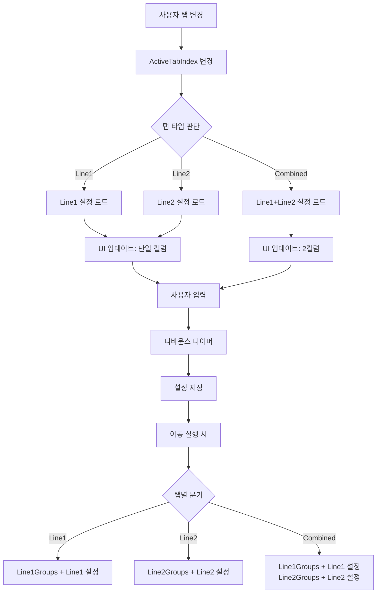
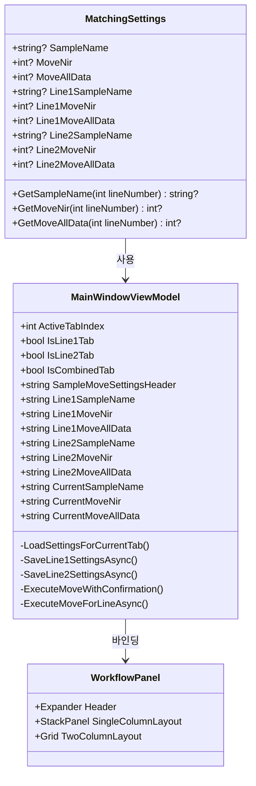

# 탭별 샘플 이동 설정 동적 변경 기능 디자인 문서

## 1. 개요

### 1.1 목적
크로노 뷰의 좌측 패널에 있는 "샘플 이동 설정" 영역을 현재 활성화된 탭(Line1/Line2/Combined)에 따라 동적으로 변경하여, 각 탭에서 해당 라인 전용 설정을 표시하고 관리할 수 있도록 합니다.

### 1.2 요구사항
- **Line1 탭 활성화 시**: "Line1 이동 설정" 헤더로 변경, Line1 전용 시료명/NIR 이동/전체 이동 값 표시
- **Line2 탭 활성화 시**: "Line2 이동 설정" 헤더로 변경, Line2 전용 시료명/NIR 이동/전체 이동 값 표시
- **Combined 탭 활성화 시**: "통합 이동 설정" 헤더로 변경, 2컬럼 레이아웃(좌: Line1, 우: Line2)으로 양쪽 라인 설정 동시 표시
- **이동 실행**: 각 탭에서 해당 라인의 설정값과 그룹을 사용하여 이동 작업 수행

### 1.3 범위
- 데이터 모델 확장 (`MatchingSettings`)
- ViewModel 로직 확장 (`MainWindowViewModel`)
- UI 레이아웃 변경 (`WorkflowPanel.xaml`)
- 이동 실행 로직 분기 (`ExecuteMoveWithConfirmation`)
- 하위 호환성 유지 (기존 설정값 폴백)

---

## 2. 아키텍처 설계

### 2.1 데이터 흐름도



### 2.2 클래스 다이어그램



---

## 3. 상세 설계

### 3.1 데이터 모델 확장

#### 3.1.1 MatchingSettings 클래스 확장

**파일**: `ChronoView/Models/ApplicationConfiguration.cs`

**변경 사항**:
- 기존 필드 유지 (하위 호환성)
- Line1/Line2 전용 필드 추가
- 헬퍼 메서드 추가 (폴백 로직 포함)

**구현 코드**:

```csharp
public class MatchingSettings
{
    // 기존 필드 (하위 호환성 유지)
    public string? SampleName { get; set; } = null;
    public int? MoveNir { get; set; } = null;
    public int? MoveAllData { get; set; } = null;

    // Line 1 전용 설정
    public string? Line1SampleName { get; set; } = null;
    public int? Line1MoveNir { get; set; } = null;
    public int? Line1MoveAllData { get; set; } = null;

    // Line 2 전용 설정
    public string? Line2SampleName { get; set; } = null;
    public int? Line2MoveNir { get; set; } = null;
    public int? Line2MoveAllData { get; set; } = null;

    /// <summary>
    /// 라인별 시료명 가져오기 (라인별 설정이 없으면 기본값 사용)
    /// </summary>
    public string? GetSampleName(int lineNumber)
    {
        return lineNumber switch
        {
            1 => Line1SampleName ?? SampleName,
            2 => Line2SampleName ?? SampleName,
            _ => SampleName
        };
    }

    /// <summary>
    /// 라인별 NIR 이동 개수 가져오기 (라인별 설정이 없으면 기본값 사용)
    /// </summary>
    public int? GetMoveNir(int lineNumber)
    {
        return lineNumber switch
        {
            1 => Line1MoveNir ?? MoveNir,
            2 => Line2MoveNir ?? MoveNir,
            _ => MoveNir
        };
    }

    /// <summary>
    /// 라인별 전체 데이터 이동 개수 가져오기 (라인별 설정이 없으면 기본값 사용)
    /// </summary>
    public int? GetMoveAllData(int lineNumber)
    {
        return lineNumber switch
        {
            1 => Line1MoveAllData ?? MoveAllData,
            2 => Line2MoveAllData ?? MoveAllData,
            _ => MoveAllData
        };
    }
}
```

**설명**:
- 기존 필드는 하위 호환성을 위해 유지
- 라인별 필드가 `null`이면 기존 필드 값을 폴백으로 사용
- 헬퍼 메서드를 통해 일관된 접근 제공

---

### 3.2 ViewModel 확장

#### 3.2.1 MainWindowViewModel 프로퍼티 추가

**파일**: `ChronoView/UI/ViewModels/MainWindowViewModel.cs`

**추가 프로퍼티**:

```csharp
// 탭 상태 프로퍼티
public bool IsLine1Tab => ActiveTabIndex == 0;
public bool IsLine2Tab => ActiveTabIndex == 1;
public bool IsCombinedTab => ActiveTabIndex == 2;

// 동적 헤더 텍스트
public string SampleMoveSettingsHeader
{
    get
    {
        return ActiveTabIndex switch
        {
            0 => "Line1 이동 설정",
            1 => "Line2 이동 설정",
            2 => "통합 이동 설정",
            _ => "샘플 이동 설정"
        };
    }
}

// Line 1 프로퍼티
private string _line1SampleName = "";
public string Line1SampleName 
{ 
    get => _line1SampleName; 
    set 
    { 
        if (SetProperty(ref _line1SampleName, value) && !_isLoadingSettings) 
        {
            _ = SaveLine1SettingsAsync(); 
        }
    } 
}

private string _line1MoveNir = "";
public string Line1MoveNir 
{ 
    get => _line1MoveNir; 
    set 
    { 
        if (SetProperty(ref _line1MoveNir, value) && !_isLoadingSettings) 
        {
            _ = SaveLine1SettingsAsync(); 
        }
    } 
}

private string _line1MoveAllData = "";
public string Line1MoveAllData 
{ 
    get => _line1MoveAllData; 
    set 
    { 
        if (SetProperty(ref _line1MoveAllData, value) && !_isLoadingSettings) 
        {
            _ = SaveLine1SettingsAsync(); 
        }
    } 
}

// Line 2 프로퍼티
private string _line2SampleName = "";
public string Line2SampleName 
{ 
    get => _line2SampleName; 
    set 
    { 
        if (SetProperty(ref _line2SampleName, value) && !_isLoadingSettings) 
        {
            _ = SaveLine2SettingsAsync(); 
        }
    } 
}

private string _line2MoveNir = "";
public string Line2MoveNir 
{ 
    get => _line2MoveNir; 
    set 
    { 
        if (SetProperty(ref _line2MoveNir, value) && !_isLoadingSettings) 
        {
            _ = SaveLine2SettingsAsync(); 
        }
    } 
}

private string _line2MoveAllData = "";
public string Line2MoveAllData 
{ 
    get => _line2MoveAllData; 
    set 
    { 
        if (SetProperty(ref _line2MoveAllData, value) && !_isLoadingSettings) 
        {
            _ = SaveLine2SettingsAsync(); 
        }
    } 
}

// 현재 탭에 표시할 프로퍼티 (Line1/Line2 탭용)
public string CurrentSampleName => IsCombinedTab ? "" : (IsLine1Tab ? Line1SampleName : Line2SampleName);
public string CurrentMoveNir => IsCombinedTab ? "" : (IsLine1Tab ? Line1MoveNir : Line2MoveNir);
public string CurrentMoveAllData => IsCombinedTab ? "" : (IsLine1Tab ? Line1MoveAllData : Line2MoveAllData);
```

**설명**:
- `IsLine1Tab`, `IsLine2Tab`, `IsCombinedTab`: 탭 상태 판단용
- `SampleMoveSettingsHeader`: 동적 헤더 텍스트
- 라인별 프로퍼티: 각 라인 전용 설정값
- `Current*` 프로퍼티: Line1/Line2 탭에서 단일 컬럼 레이아웃에 바인딩

#### 3.2.2 ActiveTabIndex 변경 감지 및 설정 로드

**기존 코드 수정**:

```csharp
private int _activeTabIndex;
public int ActiveTabIndex
{
    get => _activeTabIndex;
    set
    {
        if (SetProperty(ref _activeTabIndex, value))
        {
            // 탭 상태 프로퍼티 업데이트
            OnPropertyChanged(nameof(IsLine1Tab));
            OnPropertyChanged(nameof(IsLine2Tab));
            OnPropertyChanged(nameof(IsCombinedTab));
            OnPropertyChanged(nameof(SampleMoveSettingsHeader));
            
            // 현재 탭 프로퍼티 업데이트
            OnPropertyChanged(nameof(CurrentSampleName));
            OnPropertyChanged(nameof(CurrentMoveNir));
            OnPropertyChanged(nameof(CurrentMoveAllData));
            
            // 탭 변경 시 해당 라인 설정 로드
            LoadSettingsForCurrentTab();
        }
    }
}
```

**새로운 메서드 추가**:

```csharp
private void LoadSettingsForCurrentTab()
{
    _isLoadingSettings = true;
    try
    {
        var config = _configManager.LoadConfiguration<ApplicationConfiguration>();
        if (config != null)
        {
            if (IsLine1Tab)
            {
                // Line1 설정 로드 (라인별 설정이 없으면 기본값 사용)
                _line1SampleName = config.MatchingSettings.Line1SampleName 
                    ?? config.MatchingSettings.SampleName ?? "";
                _line1MoveNir = config.MatchingSettings.Line1MoveNir?.ToString() 
                    ?? config.MatchingSettings.MoveNir?.ToString() ?? "";
                _line1MoveAllData = config.MatchingSettings.Line1MoveAllData?.ToString() 
                    ?? config.MatchingSettings.MoveAllData?.ToString() ?? "";
                OnPropertyChanged(nameof(Line1SampleName));
                OnPropertyChanged(nameof(Line1MoveNir));
                OnPropertyChanged(nameof(Line1MoveAllData));
            }
            else if (IsLine2Tab)
            {
                // Line2 설정 로드
                _line2SampleName = config.MatchingSettings.Line2SampleName 
                    ?? config.MatchingSettings.SampleName ?? "";
                _line2MoveNir = config.MatchingSettings.Line2MoveNir?.ToString() 
                    ?? config.MatchingSettings.MoveNir?.ToString() ?? "";
                _line2MoveAllData = config.MatchingSettings.Line2MoveAllData?.ToString() 
                    ?? config.MatchingSettings.MoveAllData?.ToString() ?? "";
                OnPropertyChanged(nameof(Line2SampleName));
                OnPropertyChanged(nameof(Line2MoveNir));
                OnPropertyChanged(nameof(Line2MoveAllData));
            }
            else if (IsCombinedTab)
            {
                // Combined 탭: 양쪽 라인 설정 모두 로드
                // Line1 설정
                _line1SampleName = config.MatchingSettings.Line1SampleName 
                    ?? config.MatchingSettings.SampleName ?? "";
                _line1MoveNir = config.MatchingSettings.Line1MoveNir?.ToString() 
                    ?? config.MatchingSettings.MoveNir?.ToString() ?? "";
                _line1MoveAllData = config.MatchingSettings.Line1MoveAllData?.ToString() 
                    ?? config.MatchingSettings.MoveAllData?.ToString() ?? "";
                OnPropertyChanged(nameof(Line1SampleName));
                OnPropertyChanged(nameof(Line1MoveNir));
                OnPropertyChanged(nameof(Line1MoveAllData));
                
                // Line2 설정
                _line2SampleName = config.MatchingSettings.Line2SampleName 
                    ?? config.MatchingSettings.SampleName ?? "";
                _line2MoveNir = config.MatchingSettings.Line2MoveNir?.ToString() 
                    ?? config.MatchingSettings.MoveNir?.ToString() ?? "";
                _line2MoveAllData = config.MatchingSettings.Line2MoveAllData?.ToString() 
                    ?? config.MatchingSettings.MoveAllData?.ToString() ?? "";
                OnPropertyChanged(nameof(Line2SampleName));
                OnPropertyChanged(nameof(Line2MoveNir));
                OnPropertyChanged(nameof(Line2MoveAllData));
            }
        }
    }
    finally
    {
        _isLoadingSettings = false;
    }
}
```

#### 3.2.3 라인별 설정 저장 메서드

**기존 `SaveSampleMoveSettingsAsync` 대체**:

```csharp
// Line1 설정 저장
private System.Windows.Threading.DispatcherTimer? _saveLine1DebounceTimer;
private readonly object _saveLine1Lock = new object();

private async Task SaveLine1SettingsAsync()
{
    try
    {
        lock (_saveLine1Lock)
        {
            _saveLine1DebounceTimer?.Stop();
            _saveLine1DebounceTimer = new System.Windows.Threading.DispatcherTimer
            {
                Interval = TimeSpan.FromMilliseconds(500)
            };
            _saveLine1DebounceTimer.Tick += async (s, e) =>
            {
                _saveLine1DebounceTimer.Stop();
                try
                {
                    var config = await _configManager.LoadConfigurationAsync<ApplicationConfiguration>();
                    
                    config.MatchingSettings.Line1SampleName = string.IsNullOrWhiteSpace(Line1SampleName) 
                        ? null : Line1SampleName;
                    config.MatchingSettings.Line1MoveNir = string.IsNullOrWhiteSpace(Line1MoveNir) 
                        ? null 
                        : (int.TryParse(Line1MoveNir, out int nirValue) ? nirValue : null);
                    config.MatchingSettings.Line1MoveAllData = string.IsNullOrWhiteSpace(Line1MoveAllData) 
                        ? null 
                        : (int.TryParse(Line1MoveAllData, out int allValue) ? allValue : null);
                    
                    await _configManager.SaveConfigurationAsync(config);
                    _logger.LogDebug("Line1 move settings saved: SampleName={SampleName}, MoveNir={MoveNir}, MoveAllData={MoveAllData}", 
                        Line1SampleName, Line1MoveNir, Line1MoveAllData);
                }
                catch (Exception ex)
                {
                    _logger.LogError(ex, "Failed to save Line1 move settings");
                }
            };
            _saveLine1DebounceTimer.Start();
        }
    }
    catch (Exception ex)
    {
        _logger.LogError(ex, "Error setting up Line1 save debounce timer");
    }
}

// Line2 설정 저장 (동일한 패턴)
private System.Windows.Threading.DispatcherTimer? _saveLine2DebounceTimer;
private readonly object _saveLine2Lock = new object();

private async Task SaveLine2SettingsAsync()
{
    // Line1과 동일한 로직, Line2 프로퍼티 사용
    // ... (구현 생략)
}
```

**기존 프로퍼티 처리**:
- 기존 `SampleName`, `MoveNir`, `MoveAllData` 프로퍼티는 하위 호환성을 위해 유지
- 초기 로드 시 기존 값으로 Line1/Line2 설정 초기화 (선택사항)

#### 3.2.4 LoadSettings 메서드 수정

**기존 `LoadSettings` 메서드에 추가**:

```csharp
public void LoadSettings()
{
    _isLoadingSettings = true;
    try
    {
        // ... 기존 코드 ...
        
        // 샘플 이동 설정 로드 (기존 코드 유지 - 하위 호환성)
        _sampleName = config.MatchingSettings.SampleName ?? "";
        _moveNir = config.MatchingSettings.MoveNir?.ToString() ?? "";
        _moveAllData = config.MatchingSettings.MoveAllData?.ToString() ?? "";
        OnPropertyChanged(nameof(SampleName));
        OnPropertyChanged(nameof(MoveNir));
        OnPropertyChanged(nameof(MoveAllData));
        
        // 현재 탭에 맞는 설정 로드
        LoadSettingsForCurrentTab();
    }
    finally
    {
        _isLoadingSettings = false;
    }
}
```

---

### 3.3 UI 구조 변경

#### 3.3.1 Converter 추가

**파일**: `ChronoView/Converters/InverseBoolToVisibilityConverter.cs` (신규 생성)

```csharp
using System.Globalization;
using System.Windows;
using System.Windows.Data;

namespace ChronoView;

/// <summary>
/// Converts boolean values to Visibility (true = Collapsed, false = Visible).
/// Inverse of BoolToVisibilityConverter.
/// </summary>
public class InverseBoolToVisibilityConverter : IValueConverter
{
    public object Convert(object value, Type targetType, object parameter, CultureInfo culture)
    {
        if (value is bool boolValue)
        {
            return boolValue ? Visibility.Collapsed : Visibility.Visible;
        }
        return Visibility.Visible;
    }

    public object ConvertBack(object value, Type targetType, object parameter, CultureInfo culture)
    {
        if (value is Visibility visibility)
        {
            return visibility == Visibility.Collapsed;
        }
        return true;
    }
}
```

**리소스 등록**: `ChronoView/Resources/SharedResources.xaml`

```xml
<converters:InverseBoolToVisibilityConverter x:Key="InverseBoolToVisibilityConverter"/>
```

#### 3.3.2 WorkflowPanel.xaml 수정

**파일**: `ChronoView/UI/Controls/WorkflowPanel.xaml`

**변경 사항**:
- Expander 헤더를 동적 바인딩으로 변경
- Line1/Line2 탭용 단일 컬럼 레이아웃 추가
- Combined 탭용 2컬럼 레이아웃 추가
- Visibility 바인딩으로 레이아웃 전환

**구현 코드**:

```xml
<!-- Sample Move Settings Section -->
<Expander Header="{Binding SampleMoveSettingsHeader}" IsExpanded="True" 
          Background="{StaticResource HoverBrush}" Margin="0,0,0,1">
    <StackPanel Margin="10">
        <!-- Line1/Line2 탭: 단일 컬럼 레이아웃 -->
        <StackPanel Visibility="{Binding IsCombinedTab, Converter={StaticResource InverseBoolToVisibilityConverter}}">
            <TextBlock Text="{x:Static res:Strings.Label_MoveSettings}" FontWeight="Bold" Margin="0,0,0,8"/>
            <Label Content="{x:Static res:Strings.Sample_Name}" FontSize="10"/>
            <TextBox Text="{Binding CurrentSampleName, UpdateSourceTrigger=PropertyChanged}" Margin="0,0,0,8"/>
            <Label Content="{x:Static res:Strings.Sample_MoveNIR}" FontSize="10"/>
            <TextBox Text="{Binding CurrentMoveNir, UpdateSourceTrigger=PropertyChanged}" Margin="0,0,0,8"/>
            <Label Content="{x:Static res:Strings.Sample_MoveAllData}" FontSize="10"/>
            <TextBox Text="{Binding CurrentMoveAllData, UpdateSourceTrigger=PropertyChanged}"/>
        </StackPanel>
        
        <!-- Combined 탭: 2컬럼 레이아웃 -->
        <Grid Visibility="{Binding IsCombinedTab, Converter={StaticResource BoolToVisibilityConverter}}">
            <Grid.ColumnDefinitions>
                <ColumnDefinition Width="*"/>
                <ColumnDefinition Width="10"/>
                <ColumnDefinition Width="*"/>
            </Grid.ColumnDefinitions>
            
            <!-- Line 1 컬럼 -->
            <StackPanel Grid.Column="0">
                <TextBlock Text="Line 1" FontWeight="Bold" Margin="0,0,0,8"/>
                <Label Content="{x:Static res:Strings.Sample_Name}" FontSize="10"/>
                <TextBox Text="{Binding Line1SampleName, UpdateSourceTrigger=PropertyChanged}" Margin="0,0,0,8"/>
                <Label Content="{x:Static res:Strings.Sample_MoveNIR}" FontSize="10"/>
                <TextBox Text="{Binding Line1MoveNir, UpdateSourceTrigger=PropertyChanged}" Margin="0,0,0,8"/>
                <Label Content="{x:Static res:Strings.Sample_MoveAllData}" FontSize="10"/>
                <TextBox Text="{Binding Line1MoveAllData, UpdateSourceTrigger=PropertyChanged}"/>
            </StackPanel>
            
            <!-- Line 2 컬럼 -->
            <StackPanel Grid.Column="2">
                <TextBlock Text="Line 2" FontWeight="Bold" Margin="0,0,0,8"/>
                <Label Content="{x:Static res:Strings.Sample_Name}" FontSize="10"/>
                <TextBox Text="{Binding Line2SampleName, UpdateSourceTrigger=PropertyChanged}" Margin="0,0,0,8"/>
                <Label Content="{x:Static res:Strings.Sample_MoveNIR}" FontSize="10"/>
                <TextBox Text="{Binding Line2MoveNir, UpdateSourceTrigger=PropertyChanged}" Margin="0,0,0,8"/>
                <Label Content="{x:Static res:Strings.Sample_MoveAllData}" FontSize="10"/>
                <TextBox Text="{Binding Line2MoveAllData, UpdateSourceTrigger=PropertyChanged}"/>
            </StackPanel>
        </Grid>
    </StackPanel>
</Expander>
```

**설명**:
- `InverseBoolToVisibilityConverter`: Combined 탭이 아닐 때 단일 컬럼 표시
- `BoolToVisibilityConverter`: Combined 탭일 때 2컬럼 표시
- 각 레이아웃은 독립적으로 바인딩되어 탭 변경 시 자동 전환

---

### 3.4 이동 실행 로직 변경

#### 3.4.1 ExecuteMoveWithConfirmation 수정

**파일**: `ChronoView/UI/ViewModels/MainWindowViewModel.cs`

**변경 사항**:
- 탭별로 분기하여 해당 라인의 그룹과 설정값 사용
- Combined 탭은 Line1 → Line2 순으로 연속 실행

**구현 코드**:

```csharp
private async void ExecuteMoveWithConfirmation()
{
    try
    {
        // 1. 실시간 감지 중인지 확인 (기존과 동일)
        if (IsMonitoring)
        {
            var monitoringResult = System.Windows.MessageBox.Show(
                "실시간 감지 중입니다.\n이동 작업을 진행하시겠습니까?\n\n" +
                "(예를 선택하면 실시간 감지가 중지됩니다)",
                "실시간 감지 중",
                System.Windows.MessageBoxButton.YesNo,
                System.Windows.MessageBoxImage.Warning);

            if (monitoringResult != System.Windows.MessageBoxResult.Yes)
                return;

            await Control.StopMonitoringAsync();
        }

        // 2. 탭별 분기
        if (IsLine1Tab)
        {
            await ExecuteMoveForLineAsync(1, Line1SampleName, Line1MoveNir, Line1MoveAllData, Dashboard.Line1Groups.ToList());
        }
        else if (IsLine2Tab)
        {
            await ExecuteMoveForLineAsync(2, Line2SampleName, Line2MoveNir, Line2MoveAllData, Dashboard.Line2Groups.ToList());
        }
        else if (IsCombinedTab)
        {
            // Combined: 양쪽 라인을 각각 설정값으로 연속 실행
            var appConfig = (WpfApplication.Current as App)?.Services.GetService(typeof(IConfigurationManager)) as IConfigurationManager;
            var config = appConfig?.LoadConfiguration<ApplicationConfiguration>();
            var outputPath = config?.MatchingSettings.OutputPath ?? "(설정되지 않음)";

            var message = "다음 데이터를 이동합니다:\n\n";
            message += "=== Line 1 ===\n";
            message += BuildMoveMessage(1, Line1SampleName, Line1MoveNir, Line1MoveAllData, Dashboard.Line1Groups.Count);
            message += "\n=== Line 2 ===\n";
            message += BuildMoveMessage(2, Line2SampleName, Line2MoveNir, Line2MoveAllData, Dashboard.Line2Groups.Count);
            message += $"\n📁 이동 경로: {outputPath}\n\n";
            message += "진행하시겠습니까?";

            var result = System.Windows.MessageBox.Show(message, "통합 이동 확인", System.Windows.MessageBoxButton.YesNo, System.Windows.MessageBoxImage.Question);
            if (result == System.Windows.MessageBoxResult.Yes)
            {
                try
                {
                    StatusMessage = "Processing Line1...";
                    await ExecuteMoveForLineAsync(1, Line1SampleName, Line1MoveNir, Line1MoveAllData, Dashboard.Line1Groups.ToList());
                    
                    StatusMessage = "Processing Line2...";
                    await ExecuteMoveForLineAsync(2, Line2SampleName, Line2MoveNir, Line2MoveAllData, Dashboard.Line2Groups.ToList());

                    StatusMessage = "Refreshing data...";
                    await Operations.RefreshDataAsync();
                    await Control.RefreshMonitoringAsync();

                    if (StatusMessage == "Refreshed")
                    {
                        StatusMessage = "Ready";
                    }
                    else
                    {
                        _logger.LogWarning("Refresh may be incomplete due to configuration issues.");
                        StatusMessage = "Refresh completed with warnings. Check settings.";
                    }
                }
                catch (Exception ex)
                {
                    _logger.LogError(ex, "Error during combined move operation or refresh");
                    StatusMessage = $"Move failed: {ex.Message}";
                    System.Windows.MessageBox.Show($"이동 작업 중 오류 발생: {ex.Message}", "오류",
                        System.Windows.MessageBoxButton.OK, System.Windows.MessageBoxImage.Error);
                }
            }
        }
    }
    catch (Exception ex)
    {
        _logger.LogError(ex, "Error in ExecuteMoveWithConfirmation");
        System.Windows.MessageBox.Show($"이동 작업 중 오류 발생: {ex.Message}", "오류",
            System.Windows.MessageBoxButton.OK, System.Windows.MessageBoxImage.Error);
    }
}
```

#### 3.4.2 ExecuteMoveForLineAsync 헬퍼 메서드

**새로운 메서드 추가**:

```csharp
private async Task ExecuteMoveForLineAsync(int lineNumber, string sampleName, string moveNir, string moveAllData, List<FileGroupViewModel> groups)
{
    if (groups.Count == 0)
    {
        _logger.LogInformation("No groups to move for Line {LineNumber}", lineNumber);
        return;
    }

    try
    {
        var nirCount = int.TryParse(moveNir, out int n) ? n : 0;
        var allCount = int.TryParse(moveAllData, out int a) ? a : 0;

        bool isNirEmpty = string.IsNullOrWhiteSpace(moveNir);
        bool isAllDataEmpty = string.IsNullOrWhiteSpace(moveAllData);

        var appConfig = (WpfApplication.Current as App)?.Services.GetService(typeof(IConfigurationManager)) as IConfigurationManager;
        var config = appConfig?.LoadConfiguration<ApplicationConfiguration>();
        var outputPath = config?.MatchingSettings.OutputPath ?? "(설정되지 않음)";

        // 메시지 구성
        var message = $"Line {lineNumber} 데이터를 이동합니다:\n\n";

        if (isNirEmpty)
        {
            message += $"• NIR 파일: 전체 이동 (값이 입력되지 않음)\n";
        }
        else
        {
            message += $"• NIR 파일: {nirCount}개\n";
        }

        if (isAllDataEmpty)
        {
            message += $"• 전체 데이터: 전체 이동 (값이 입력되지 않음)\n";
        }
        else
        {
            message += $"• 전체 데이터: {allCount}개\n";
        }

        message += "\n";

        if (isNirEmpty || isAllDataEmpty)
        {
            message += "⚠️ 경고:\n";
            var emptyFields = new List<string>();
            if (isNirEmpty) emptyFields.Add("NIR 이동");
            if (isAllDataEmpty) emptyFields.Add("전체 데이터 이동");
            message += $"• {string.Join(", ", emptyFields)} 필드에 값이 없습니다.\n";
            message += $"• 값이 없을 경우 해당 항목은 전체가 이동됩니다.\n\n";
        }

        message += $"📁 이동 경로: {outputPath}\n\n";
        message += "진행하시겠습니까?";

        var result = System.Windows.MessageBox.Show(message, $"Line {lineNumber} 이동 확인", System.Windows.MessageBoxButton.YesNo, System.Windows.MessageBoxImage.Question);
        if (result == System.Windows.MessageBoxResult.Yes)
        {
            await Operations.ExecuteMoveAsync(groups, moveNir, moveAllData, sampleName);
        }
    }
    catch (Exception ex)
    {
        _logger.LogError(ex, "Error during move operation for Line {LineNumber}", lineNumber);
        throw;
    }
}

private string BuildMoveMessage(int lineNumber, string sampleName, string moveNir, string moveAllData, int groupCount)
{
    var nirCount = int.TryParse(moveNir, out int n) ? n : 0;
    var allCount = int.TryParse(moveAllData, out int a) ? a : 0;
    bool isNirEmpty = string.IsNullOrWhiteSpace(moveNir);
    bool isAllDataEmpty = string.IsNullOrWhiteSpace(moveAllData);

    var message = "";
    if (isNirEmpty)
    {
        message += $"• NIR 파일: 전체 이동 (값이 입력되지 않음)\n";
    }
    else
    {
        message += $"• NIR 파일: {nirCount}개\n";
    }

    if (isAllDataEmpty)
    {
        message += $"• 전체 데이터: 전체 이동 (값이 입력되지 않음)\n";
    }
    else
    {
        message += $"• 전체 데이터: {allCount}개\n";
    }

    message += $"• 대상 그룹: {groupCount}개\n";

    return message;
}
```

---

## 4. 구현 단계

### Phase 1: 데이터 모델 및 ViewModel 기본 구조
1. `MatchingSettings` 클래스에 라인별 필드 추가
2. `MainWindowViewModel`에 라인별 프로퍼티 추가
3. `ActiveTabIndex` 변경 감지 로직 구현
4. `LoadSettingsForCurrentTab` 메서드 구현

### Phase 2: UI 레이아웃 변경
5. `InverseBoolToVisibilityConverter` 생성 및 등록
6. `WorkflowPanel.xaml` 동적 레이아웃 구현
7. 헤더 동적 바인딩 적용

### Phase 3: 저장 로직 분리
8. `SaveLine1SettingsAsync` 구현
9. `SaveLine2SettingsAsync` 구현
10. 디바운스 타이머 독립 관리

### Phase 4: 이동 실행 로직 분기
11. `ExecuteMoveWithConfirmation` 탭별 분기 구현
12. `ExecuteMoveForLineAsync` 헬퍼 메서드 구현
13. `BuildMoveMessage` 헬퍼 메서드 구현
14. Combined 탭 연속 실행 로직 구현

### Phase 5: 테스트 및 검증
15. 각 탭에서 설정 로드/저장 테스트
16. 이동 실행 동작 테스트
17. 하위 호환성 검증 (기존 설정값 폴백)

---

## 5. 하위 호환성

### 5.1 기존 설정값 처리
- 기존 `SampleName`, `MoveNir`, `MoveAllData` 필드는 유지
- 라인별 설정이 없을 경우 기존 값 사용 (폴백)
- 기존 설정 파일은 자동으로 호환됨

### 5.2 마이그레이션 (선택사항)
- 필요 시 기존 설정값을 Line1/Line2 설정으로 복사하는 마이그레이션 스크립트 제공 가능
- 기본적으로는 폴백 로직으로 충분

---

## 6. 테스트 시나리오

### 6.1 기본 기능 테스트
1. **Line1 탭 활성화**
   - 헤더가 "Line1 이동 설정"으로 변경되는지 확인
   - Line1 전용 설정값이 표시되는지 확인
   - 설정값 변경 시 Line1 설정만 저장되는지 확인

2. **Line2 탭 활성화**
   - 헤더가 "Line2 이동 설정"으로 변경되는지 확인
   - Line2 전용 설정값이 표시되는지 확인
   - 설정값 변경 시 Line2 설정만 저장되는지 확인

3. **Combined 탭 활성화**
   - 헤더가 "통합 이동 설정"으로 변경되는지 확인
   - 2컬럼 레이아웃이 표시되는지 확인
   - 양쪽 라인 설정이 동시에 표시되는지 확인
   - 각 설정값 변경 시 해당 라인 설정만 저장되는지 확인

### 6.2 이동 실행 테스트
1. **Line1 탭에서 이동 실행**
   - Line1Groups만 이동되는지 확인
   - Line1 설정값이 사용되는지 확인

2. **Line2 탭에서 이동 실행**
   - Line2Groups만 이동되는지 확인
   - Line2 설정값이 사용되는지 확인

3. **Combined 탭에서 이동 실행**
   - Line1Groups → Line2Groups 순으로 연속 실행되는지 확인
   - 각 라인별 설정값이 적용되는지 확인
   - 확인 메시지에 양쪽 라인 정보가 포함되는지 확인

### 6.3 하위 호환성 테스트
1. **기존 설정 파일 로드**
   - 라인별 설정이 없을 때 기존 값이 폴백으로 사용되는지 확인
   - 설정값 저장 후 라인별 필드에 저장되는지 확인

---

## 7. 참고 파일 목록

### 핵심 파일
- `ChronoView/Models/ApplicationConfiguration.cs` - 설정 모델
- `ChronoView/UI/ViewModels/MainWindowViewModel.cs` - 메인 뷰모델
- `ChronoView/UI/Controls/WorkflowPanel.xaml` - 샘플 이동 설정 UI
- `ChronoView/MainWindow.xaml` - 탭 구조
- `ChronoView/UI/ViewModels/FileOperationViewModel.cs` - 이동 실행 로직
- `ChronoView/UI/ViewModels/DashboardViewModel.cs` - 라인별 그룹 관리

### 관련 파일
- `ChronoView/Models/FileGroup.cs` - 라인 번호 속성
- `ChronoView/Core/FileOperations/MoveService.cs` - 이동 서비스
- `ChronoView/Resources/Strings.resx` - 리소스 문자열
- `ChronoView/Converters/BoolToVisibilityConverter.cs` - 기존 Converter
- `ChronoView/Resources/SharedResources.xaml` - 리소스 등록

---

## 8. 주의사항

### 8.1 성능
- 탭 변경 시 설정 로드는 동기적으로 빠르게 처리 (파일 I/O 최소화)
- 디바운스 타이머는 라인별로 독립적으로 관리하여 동시 저장 충돌 방지

### 8.2 사용자 경험
- 탭 변경 시 즉시 해당 라인 설정 표시 (로딩 지연 최소화)
- Combined 탭에서 양쪽 설정을 명확히 구분 (헤더 및 레이아웃)
- 이동 확인 메시지에 라인 정보 포함하여 사용자 혼란 방지

### 8.3 에러 처리
- 설정 로드 실패 시 기본값 사용
- 저장 실패 시 로그 기록 및 사용자 알림
- 이동 실행 실패 시 부분 실패 정보 제공

---

**작성일**: 2025-01-XX  
**작성자**: AI Assistant  
**버전**: 1.0

