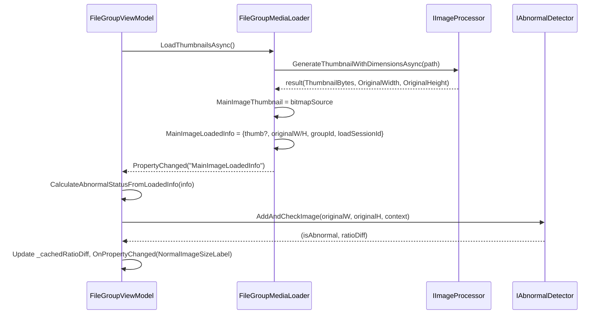
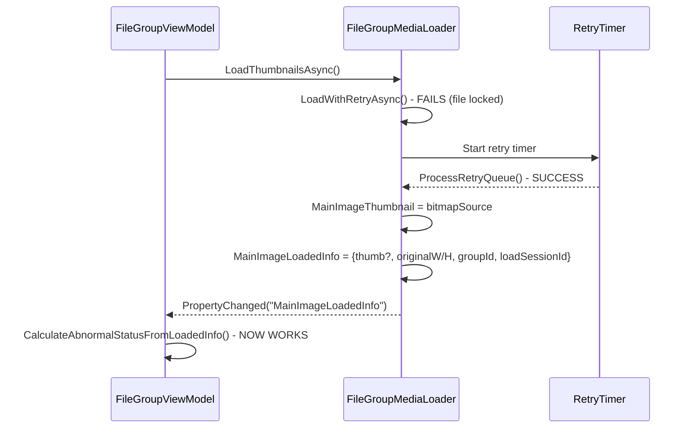
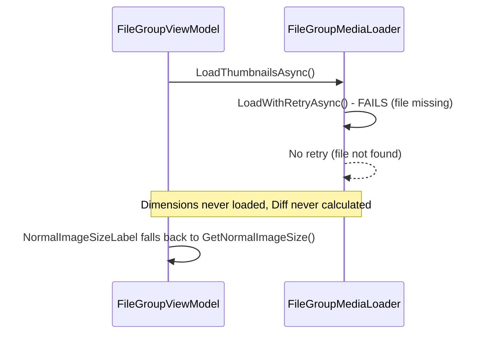

# Diff(Ratio) Calculation After Media Load - Detailed Design

## 1. Component Designs

### 1.1 FileGroupMediaLoader (Data Provider)

#### New Property (Recommended): MainImageLoadedInfo

> Loader가 Main 이미지 로드 성공 시 **단일 LoadedInfo**로 (선택)썸네일 + **원본 치수** + 상관관계 키를 함께 제공한다.
>
> Note: `MainImageThumbnail`과 `MainImageDimensions`를 별도 프로퍼티로 두면 “동시에 설정”이 원자적으로 보장되지 않아
> VM이 중간 상태를 관측할 수 있다. 따라서 **단일 프로퍼티/이벤트**를 권장한다.

```csharp
// FileGroupMediaLoader.cs - New Property (Recommended)
private MainImageLoadedInfo? _mainImageLoadedInfo;
public MainImageLoadedInfo? MainImageLoadedInfo
{
    get => _mainImageLoadedInfo;
    set => SetProperty(ref _mainImageLoadedInfo, value);
}

// Data Structure (Value Object)
public sealed record MainImageLoadedInfo(
    string GroupId,
    long LoadSessionId,
    int OriginalWidth,
    int OriginalHeight,
    byte[]? ThumbnailBytes = null,
    string? FilePath = null,
    DateTime? LoadedAtUtc = null);
```

#### Updated Method: LoadThumbnailsAsync

> 썸네일 생성 API가 **원본 치수**를 함께 반환하도록 변경된 후, Loader가 그 결과를 VM에 전달.
> 캐시 히트(디코딩 없이 썸네일만 가져오는 경우)에도 **원본 치수는 반드시 제공**되어야 한다.

```csharp
// Modified LoadWithRetryAsync usage
var result = await _imageProcessor.GenerateThumbnailWithDimensionsAsync(path, w, h, _cts.Token);

// On success, publish a single loaded-info (atomic from VM perspective)
MainImageThumbnail = ToBitmapSource(result.ThumbnailBytes); // optional legacy property
MainImageLoadedInfo = new MainImageLoadedInfo(
    groupId: _groupId,
    loadSessionId: _loadSessionId,
    originalWidth: result.OriginalWidth,
    originalHeight: result.OriginalHeight,
    thumbnailBytes: result.ThumbnailBytes,
    filePath: path,
    loadedAtUtc: DateTime.UtcNow);
```

#### Thread Safety
- **Property Updates**: `MainImageLoadedInfo`는 UI 스레드에서만 업데이트 (Dispatcher 사용).
- **Atomicity**: VM 입장에서는 `MainImageLoadedInfo`만 관측하면 되므로 중간 상태 레이스가 줄어든다.

---

### 1.2 IImageProcessor (API Extension)

#### New Method: GenerateThumbnailWithDimensions

> 썸네일 생성과 동시에 치수를 반환하여 VM의 재오픈 필요성을 제거.

```csharp
// IImageProcessor.cs - New Method
Task<ThumbnailWithDimensionsResult> GenerateThumbnailWithDimensionsAsync(
    string imagePath,
    int width,
    int height,
    CancellationToken cancellationToken = default,
    bool throwOnError = false);
```

#### Preconditions
- `imagePath`: 존재하는 파일 경로
- `width/height`: 양수
- `cancellationToken`: 유효한 취소 토큰

#### Postconditions
- Returns: `(썸네일 바이트 배열 + 원본 치수)` 결과
- 원본 치수는 **동일한 이미지 디코딩 과정**에서 추출됨 (추가 파일 I/O 없음)
- **캐시 히트**로 디코딩이 생략되는 경우에도, 원본 치수는 0이 아닌 유효값으로 제공되어야 한다(치수도 함께 캐시).
- 실패 시: `throwOnError=true`면 예외, `false`면 기본 썸네일 + (0,0) 치수 반환

---

### 1.3 ImageProcessingService (Implementation)

#### New Method Implementation

> 기존 `GenerateThumbnailAsync`를 확장하여 치수도 함께 추출.

```csharp
public async Task<ThumbnailWithDimensionsResult> GenerateThumbnailWithDimensionsAsync(
    string imagePath, int width, int height, CancellationToken cancellationToken, bool throwOnError)
{
    // ... existing validation ...

    try
    {
        await _processingSemaphore.WaitAsync(cancellationToken);

        var result = await Task.Run(async () =>
        {
            using var fileStream = new FileStream(imagePath, FileMode.Open, FileAccess.Read, FileShare.Read);
            using var image = await SixLabors.ImageSharp.Image.LoadAsync(fileStream, cancellationToken);

            // Extract ORIGINAL dimensions from loaded image (no additional decode needed)
            var originalWidth = image.Width;
            var originalHeight = image.Height;

            // Resize for thumbnail (using same loaded image)
            image.Mutate(x => x.Resize(new ResizeOptions
            {
                Size = new SixLabors.ImageSharp.Size(width, height),
                Mode = ResizeMode.Max
            }));

            using var ms = new MemoryStream();
            var encoder = new JpegEncoder { Quality = _settings.ThumbnailQuality };
            await image.SaveAsync(ms, encoder, cancellationToken);
            var thumbnailBytes = ms.ToArray();

            return new ThumbnailWithDimensionsResult(thumbnailBytes, originalWidth, originalHeight);
        }, cancellationToken);

        // Cache thumbnail + ORIGINAL dimensions together (required for cache-hit correctness)
        if (_settings.EnableCaching)
        {
            var cacheKey = $"{imagePath}_{width}x{height}";
            _thumbnailCache.Add(cacheKey, result.ThumbnailBytes);
            _thumbnailMetaCache.Add(cacheKey, (result.OriginalWidth, result.OriginalHeight));
        }

        return result;
    }
    catch (Exception ex) when (ex is not OperationCanceledException)
    {
        if (throwOnError) throw;
        _logger.LogError(ex, "Error generating thumbnail with dimensions for: {ImagePath}", imagePath);
        return new ThumbnailWithDimensionsResult(GetPlaceholderImage(width, height), 0, 0);
    }
    finally
    {
        _processingSemaphore.Release();
    }
}
```

#### Performance Notes
- **추가 비용**: 기존 썸네일 생성과 비교해 **제로 추가 I/O** (동일 스트림/동일 디코드 사용)
- **메모리**: `ImageDimensions`는 가벼운 객체 (몇 바이트)
- **스레드**: 백그라운드 `Task.Run`으로 CPU 작업 오프로드 유지
 - **캐시 정합성**: 캐시 히트 시에도 원본 치수가 필요하므로, “치수도 함께 캐시”가 필수

---

### 1.4 FileGroupViewModel (Consumer & Trigger)

#### Modified Constructor & Property Change Handler

> 초기 계산 제거하고, 미디어 로드 성공에서만 Diff 계산.

```csharp
public FileGroupViewModel(/* ... */)
{
    // ... existing initialization ...

    _mediaLoader.PropertyChanged += (s, e) =>
    {
        OnPropertyChanged(e.PropertyName);

        // NEW: Calculate Diff only when LoadedInfo is available (single SSoT)
        if (e.PropertyName == nameof(_mediaLoader.MainImageLoadedInfo) &&
            _mediaLoader.MainImageLoadedInfo != null)
        {
            CalculateAbnormalStatusFromLoadedInfo(_mediaLoader.MainImageLoadedInfo);
        }
    };

    // REMOVED: InitializeImagePaths(); CheckAbnormalStatus();
    InitializeImagePaths();
    // CheckAbnormalStatus() is now called only after successful media load
}
```

#### New Method: CalculateAbnormalStatusFromLoadedInfo

> 치수를 입력으로 받아 Diff 계산 (파일 재오픈 없음).

```csharp
private void CalculateAbnormalStatusFromLoadedInfo(MainImageLoadedInfo info)
{
    // Stale guard
    if (info.GroupId != GroupId || info.LoadSessionId != _currentLoadSessionId)
        return;

    if (_abnormalDetector == null || info.OriginalWidth <= 0 || info.OriginalHeight <= 0)
        return;

    // Cache dimensions (for UI display)
    _cachedWidth = info.OriginalWidth;
    _cachedHeight = info.OriginalHeight;

    try
    {
        var context = AbnormalDetectorService.ExtractContext(_fileGroup.NormalFolder);
        var (isAbnormal, ratioDiff) = _abnormalDetector.AddAndCheckImage(
            info.OriginalWidth, info.OriginalHeight, context);

        // Cache ratio diff
        _cachedRatioDiff = ratioDiff;

        // Update UI
        OnPropertyChanged(nameof(NormalImageSizeLabel));

        if (isAbnormal)
        {
            IsAbnormal = true;
            _abnormalReason = $"Abnormal Ratio (Diff: {ratioDiff:F3})";
            _logger?.LogWarning("Group {GroupId} detected as abnormal: {Reason}",
                GroupId, _abnormalReason);
        }
    }
    catch (Exception ex)
    {
        _logger?.LogDebug(ex, "Failed to analyze image dimensions for abnormal detection: {Path}", info.FilePath);
    }
}
```

#### Modified NormalImageSizeLabel Property

> 초기 상태에서는 치수만 표시, 로드 성공 후 Diff 추가.

```csharp
public string NormalImageSizeLabel
{
    get
    {
        if (_cachedWidth > 0 && _cachedHeight > 0)
        {
            var baseLabel = $"{_cachedWidth}x{_cachedHeight}";
            if (_cachedRatioDiff.HasValue)
            {
                return $"{baseLabel} (Diff: {_cachedRatioDiff.Value:F2})";
            }
            return baseLabel; // Dimensions loaded, but Diff not yet calculated
        }
        return GetNormalImageSize(); // Fallback for error cases
    }
}
```

#### Thread Safety
- **UI Thread**: `PropertyChanged` 이벤트는 UI 스레드에서 발생하므로 `CalculateAbnormalStatusFromLoadedInfo`도 UI 스레드에서 실행
- **Race Condition**: `_cachedWidth/Height/RatioDiff`는 UI 스레드에서만 접근 (단일 스레드 가정)
- **Atomic Updates**: 치수와 Diff 캐시는 함께 업데이트되므로 일관성 유지
 - **Stale Guard**: `GroupId/LoadSessionId`로 늦은 이벤트를 필터링하여 UI 오염 방지

---

## 2. Sequence Diagrams

### 2.1 Normal Flow (Successful Load)



### 2.2 Retry Flow (Initial Load Failed)



### 2.3 Error Flow (Load Fails Permanently)



---

## 3. Data Structures

### 3.1 MainImageLoadedInfo

```csharp
public sealed record MainImageLoadedInfo(
    string GroupId,
    long LoadSessionId,
    int OriginalWidth,
    int OriginalHeight,
    byte[]? ThumbnailBytes = null,
    string? FilePath = null,
    DateTime? LoadedAtUtc = null);
```

### 3.2 Updated FileGroupViewModel Cache Fields

```csharp
// Existing fields remain
private int _cachedWidth;
private int _cachedHeight;
private double? _cachedRatioDiff;

// New field for tracking calculation state
private bool _diffCalculationAttempted; // Prevent duplicate calculations
```

---

## 4. Error Handling & Edge Cases

### 4.1 Dimensions Load Failure
- **Scenario**: 썸네일은 로드되지만 치수 추출 실패
- **Handling**: `ImageDimensions`에 Width/Height = 0 설정, VM에서 계산 스킵

### 4.2 Abnormal Detection Failure
- **Scenario**: 치수는 유효하지만 `AddAndCheckImage`에서 예외
- **Handling**: 로그 기록, Diff 캐시를 null로 유지, UI는 치수만 표시

### 4.3 Multiple Load Events
- **Scenario**: 같은 그룹이 여러 번 로드됨 (강제 새로고침 등)
- **Handling**:
  - VM에서 "이미 계산됨" 체크, 중복 계산 방지
  - 로드 세션이 바뀐 경우(`LoadSessionId` 변화)는 재계산 허용

### 4.4 Concurrent Access
- **Scenario**: UI 스레드와 백그라운드 스레드가 동시에 접근
- **Handling**: 모든 캐시 필드를 UI 스레드에서만 업데이트 (PropertyChanged 이벤트 보장)

---

## 5. Performance Considerations

### 5.1 Memory Impact
- `ImageDimensions`: 24바이트 (int + int + string ref + DateTime)
- 캐시 영향: 기존 썸네일 캐시 외 추가 오버헤드 최소

### 5.2 CPU Impact
- **제로 추가 비용**: 동일 이미지 디코딩에서 치수 추출
- **스레드 풀**: 기존 `Task.Run` 패턴 유지

### 5.3 UI Responsiveness
- Diff 계산은 UI 스레드에서 실행되나, `AddAndCheckImage`는 가벼운 산술 연산 위주
- 히스토리 크기가 크더라도 Median 계산은 O(N log N)에서 N=WindowSize (기본 40)

---

## 6. Testing Strategy

### 6.1 Unit Tests
```csharp
[Test]
public void CalculateAbnormalStatusFromDimensions_ValidDimensions_CalculatesDiff()
{
    // Arrange: Set up dimensions
    var dimensions = new ImageDimensions { Width = 1920, Height = 1080 };

    // Act: Call calculation method
    vm.CalculateAbnormalStatusFromDimensions(dimensions);

    // Assert: Check _cachedRatioDiff is set, NormalImageSizeLabel includes Diff
}
```

### 6.2 Integration Tests
- 파일 락 상황 재현: 실제 파일에 exclusive lock 걸고 초기 로드 실패 → 언락 후 재시도 성공 → Diff 표시 확인
- UI 테스트: 초기엔 "1920x1080", 로드 후 "1920x1080 (Diff: 0.05)"로 변경되는지 확인
