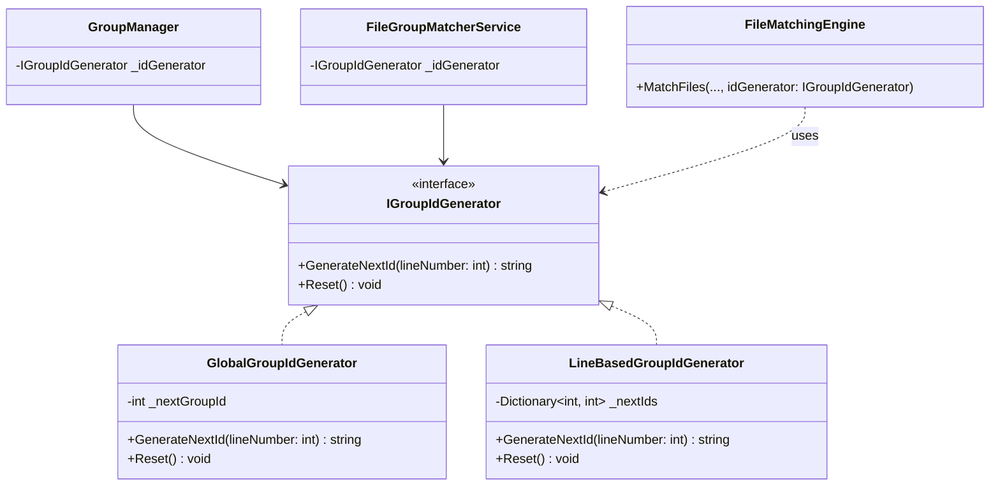

# Design: Group ID Refactoring (Strategy Pattern)

## 1. Architecture Overview

### 1.1 Goal
그룹 ID 생성 로직을 `GroupManager`와 `FileMatchingEngine`에서 분리하여 `IGroupIdGenerator` 전략 패턴으로 캡슐화한다. 이를 통해 라인별 독립 ID 포맷(`line1_XXX`)과 전역 ID 포맷(`group_XXX`)을 일관성 있게 지원한다.

### 1.2 Class Diagram


## 2. Component Design

### 2.1 Interface: IGroupIdGenerator
**Location**: `ChronoView/Core/GroupIdGeneration/IGroupIdGenerator.cs`

```csharp
/// <summary>
/// 그룹 ID 생성을 위한 전략 인터페이스.
/// </summary>
public interface IGroupIdGenerator
{
    /// <summary>
    /// 다음 그룹 ID를 생성합니다.
    /// </summary>
    /// <param name="lineNumber">라인 번호 (1 또는 2). 전역 모드에서는 무시됨.</param>
    /// <returns>생성된 그룹 ID (예: "line1_001" 또는 "group_001")</returns>
    string GenerateNextId(int lineNumber);

    /// <summary>
    /// ID 카운터를 초기화합니다.
    /// </summary>
    void Reset();
}
```

### 2.2 Implementations
**Location**: `ChronoView/Core/GroupIdGeneration/`

1.  **GlobalGroupIdGenerator** (Legacy Support)
    -   단일 `_nextGroupId` 필드 관리.
    -   **Indexing**: 1-based start (`group_001`).
    -   `GenerateNextId`:
        ```csharp
        private int _nextGroupId = 0;
        public string GenerateNextId(int lineNumber) 
        {
            var id = Interlocked.Increment(ref _nextGroupId);
            return $"group_{id:D3}"; // group_001, group_002...
        }
        ```
    -   `Reset`: `Interlocked.Exchange(ref _nextGroupId, 0)`

2.  **LineBasedGroupIdGenerator** (New Requirement)
    -   `Dictionary<int, int> _counters` 관리.
    -   **Indexing**: 1-based start (`line1_001`).
    -   `GenerateNextId`: Dictionary check/init -> increment -> `$"line{lineNumber}_{counter:D3}"`
    -   `Reset`: Dictionary Clear.

### 2.3 Integration Points

#### A. GroupManager (Real-time)
-   **Execution**: 새로운 그룹(Nir/Normal/Sequence) 생성 시 `_idGenerator.GenerateNextId(lineNumber)` 호출.
-   **Reset**: `GroupManager.ResetState()` 호출 시 `_idGenerator.Reset()` 실행.

#### B. FileMatchingEngine (Batch)
-   **Execution**: 그룹 매칭 루프 마지막 단계에서 ID 부여 시 `idGenerator.GenerateNextId(group.LineNumber)` 호출.
-   **Reset**: `FileGroupMatcherService.ResetState()`에서 `_idGenerator.Reset()` 호출.

#### C. Dependency Injection (App.xaml.cs, Factory Pattern)
-   `ApplicationConfiguration`을 먼저 로드하거나 Factory 델리게이트 내부에서 Resolve하여 설정값에 접근.
    ```csharp
    services.AddSingleton<IGroupIdGenerator>(sp =>
    {
        var config = sp.GetRequiredService<ApplicationConfiguration>();
        return config.WorkflowSettings.UseLineSpecificGroupId
            ? new LineBasedGroupIdGenerator()
            : new GlobalGroupIdGenerator();
    });
    ```

## 3. Impact Analysis

### 3.1 Test Code (Breaking Changes)
-   **Issue**: `ViewModelTests.cs`, `StatisticsServiceTests.cs` 등에서 `group_` 포맷을 하드코딩 검증함.
-   **Plan**:
    -   테스트 프로젝트(`ChronoView.Tests`)의 DI 설정에서는 기본적으로 `GlobalGroupIdGenerator`를 사용하여 기존 테스트 깨짐 방지.
    -   `LineBased` 기능을 검증하는 새 테스트 추가.
    -   하드코딩된 문자열(`"group_028"`)을 사용하는 테스트는 Generator 반환값에 의존하도록 리팩토링 검토.

## 4. Migration Steps (Revised Order)
1.  **Create Core**: `IGroupIdGenerator` 및 구현체 작성 (`ChronoView/Core/GroupIdGeneration/`).
2.  **Update Services**:
    -   `GroupManager`: 기존 로직 제거 및 `IGroupIdGenerator` 주입/사용.
    -   `FileGroupMatcherService`: 생성자 주입 추가 및 Pass-through.
3.  **Refactor Engine**: `FileMatchingEngine.MatchFiles` 시그니처 변경 및 Generator 사용.
4.  **Wire DI**: `App.xaml.cs`에서 Factory Pattern으로 Generator 등록.
5.  **Fix Tests**: 빌드 에러 수정 및 하드코딩된 ID 테스트 대응.

