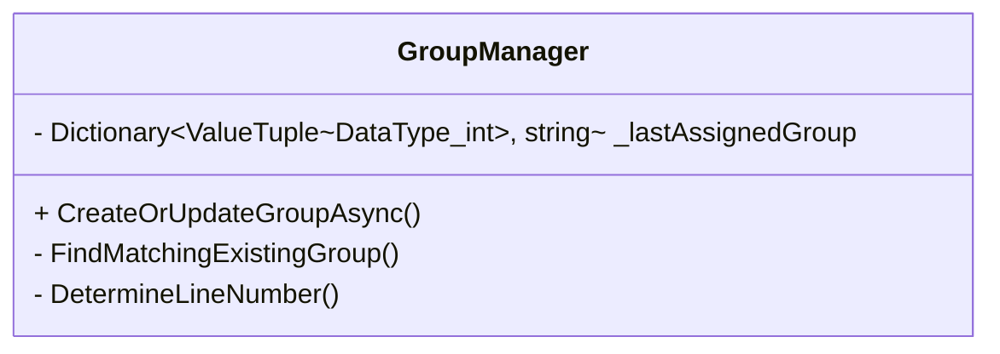

# Design: Line Separation Fix

## 1. Architectural Changes
No new major components are introduced. The core changes are confined to the internal state management and matching logic of `GroupManager`.

### 1.1 State Isolation
The `GroupManager` currently uses a single state for tracking the "last assigned group" for sequence enforcement. This will be partitioned by Line Number.

```csharp
// Old
private readonly Dictionary<DataType, string> _lastAssignedGroup

// New
private readonly Dictionary<(DataType Type, int LineNumber), string> _lastAssignedGroup
```

### 1.2 Matching Scope Restriction
The `FindMatchingExistingGroup` method currently scans all active groups and filters by line number. This logic is generally correct but fragile if `DetermineLineNumber` logic is inconsistent or if the sequence check (`_lastAssignedGroup`) allows cross-contamination.

We will strengthen this by strictly enforcing `LineNumber` equality at the very beginning of the candidate filtering process and ensuring `DetermineLineNumber` is the *single source of truth*.

**Explicit Filtering for All Match Types:**
To avoid code duplication and ensure consistency, we will introduce a private helper:
```csharp
private IEnumerable<FileGroup> FilterByLine(IEnumerable<FileGroup> groups, int lineNumber)
    => groups.Where(g => g.LineNumber == lineNumber);
```

- **Match 1 (NormalFolder)**: Use `FilterByLine(snapshot, newGroup.LineNumber)`.
- **Match 2 (NirKey)**: Use `FilterByLine(snapshot, newGroup.LineNumber)`. **CRITICAL:** `NirKey` collisions across lines must not cause cross-matching.
- **Match 3 (Sequence)**: Use `FilterByLine(snapshot, newGroup.LineNumber)`.

### 1.3 Method Maintenance
- **RemoveGroup / Clear**: No structural changes are required for these methods. `_activeGroups` remains a `ConcurrentDictionary<string, FileGroup>`, and `_lastAssignedGroup`'s value type (`string` GroupId) compatibility handles `Clear()` natively.

### 1.4 Helper Verification
> [!NOTE]
> `NormalFolderHelper.DetermineLineNumber` has been verified to correctly identify `_0` as Line 1 and `_1` as Line 2. The fix relies on this helper being used consistently.

### 1.5 UseFolderSuffix Mode Strictness
The design must respect the `UseFolderSuffix` configuration:
- **UseFolderSuffix = false**:
  - The `_0`/`_1` suffix MUST be ignored for line determination.
  - Line determination relies SOLELY on path (`Normal1Path` vs `Normal2Path`).
  - This prevents accidental Line 1 assignment if a file with `_0` is dropped into the Line 2 folder.
- **UseFolderSuffix = true**:
  - The suffix is the primary signal for line determination.
  - Fallback to path if suffix is missing.

## 2. Detailed Logic

### 2.1 Group Creation
When creating a group:
1. `DetermineLineNumber` is called.
2. The returned `LineNumber` is stamped onto the Group.
3. `_lastAssignedGroup[(Type, LineNumber)]` is updated.

### 2.2 Group Matching
When matching a file (Normal/NIR/Cam) to an existing group:
1. Determine `LineNumber` of the incoming file (e.g., Cam4 -> Line 2).
2. Filter `_activeGroups` to ONLY those with matching `LineNumber`.
3. Perform sequence check using `_lastAssignedGroup[(Type, LineNumber)]`.
    - Verification: Ensure that we are NOT checking against a group from the other line.


### 2.3 Logging
All UI logs and internal logs will prepend `[Line X]` to clarify operations.

**Implementation Detail:**
- To minimize impact, keep existing `RaiseLog(string)` and add an overload or optional parameter.
- Signature: `private void RaiseLog(string message, int? lineNumber = null)`
- If `lineNumber` is provided, prepend `[Line {lineNumber}] ` to the message.

## 3. Technical Debt & Refactoring
> [!WARNING]
> **Size Limit Exceeded**: `GroupManager.cs` is currently ~725 lines and will grow slightly with this change. It exceeds the project's 600-line soft limit and is approaching the 800-line hard limit.
> - **Decision**: Full refactoring (splitting `FindMatchingExistingGroup` into a separate service) is **deferred** to a separate task to minimize risk during this critical fix.
> - **Mitigation**: We will implement `FilterByLine` to reduce duplication and keep the new logic concise.


## 4. Class Diagram Updates
*(Minimal changes, mostly internal fields)*


