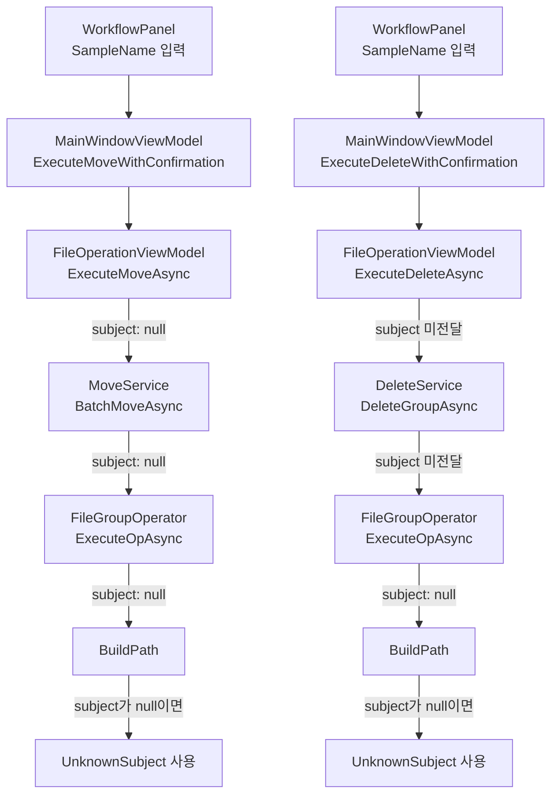
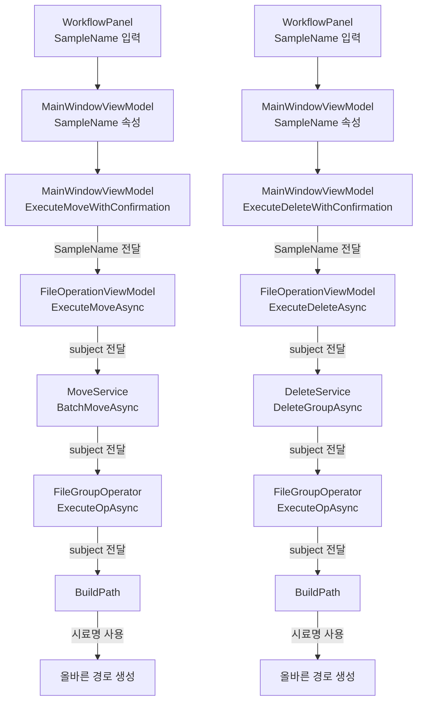

# 시료명이 이동/삭제에 반영되지 않는 문제 분석

## 문제 개요

크로노뷰의 왼쪽 패널(WorkflowPanel)에서 입력한 시료명(SampleName)이 파일 이동 및 삭제 작업에 제대로 반영되지 않는 문제가 발생하고 있습니다.

## 증상

- **이동 작업**: 왼쪽 패널의 "시료명" 필드에 값을 입력해도, 실제 파일 이동 시 시료명이 경로에 반영되지 않고 "UnknownSubject"로 처리됨
- **삭제 작업**: 시료명이 삭제 폴더 경로에 반영되지 않음

## 원인 분석

### 1. 이동(Move) 작업의 문제점

#### 1.1 MainWindowViewModel에서 시료명 미전달

```210:233:ChronoView/UI/ViewModels/MainWindowViewModel.cs
    private void ExecuteMoveWithConfirmation()
    {
        var nirCount = int.TryParse(MoveNir, out int n) ? n : 0;
        var allCount = int.TryParse(MoveAllData, out int a) ? a : 0;
        var totalGroups = Dashboard.FileGroups.Count;
        
        // Get output path from config
        var appConfig = (WpfApplication.Current as App)?.Services.GetService(typeof(IConfigurationManager)) as IConfigurationManager;
        var config = appConfig?.LoadConfiguration<ApplicationConfiguration>();
        var outputPath = config?.MatchingSettings.OutputPath ?? "(설정되지 않음)";
        
        var message = $"다음 데이터를 이동합니다:\n\n" +
                      $"• NIR 파일: {nirCount}개\n" +
                      $"• 전체 데이터: {allCount}개\n" +
                      $"(총 {totalGroups}개 그룹 중에서 가장 오래된 순서대로)\n\n" +
                      $"📁 이동 경로: {outputPath}\n\n" +
                      "진행하시겠습니까?";
        
        var result = System.Windows.MessageBox.Show(message, "이동 확인", System.Windows.MessageBoxButton.YesNo, System.Windows.MessageBoxImage.Question);
        if (result == System.Windows.MessageBoxResult.Yes)
        {
            _ = Operations.ExecuteMoveAsync(Dashboard.FileGroups.ToList(), MoveNir, MoveAllData);
        }
    }
```

**문제**: `ExecuteMoveAsync` 호출 시 `SampleName` 속성을 전달하지 않음

#### 1.2 FileOperationViewModel에서 시료명 파라미터 부재

```44:64:ChronoView/UI/ViewModels/FileOperationViewModel.cs
    public async Task ExecuteMoveAsync(IEnumerable<FileGroupViewModel> selectedGroups, string moveNirCount, string moveAllDataCount)
    {
        if (IsOperationInProgress) return;
        try {
            IsOperationInProgress = true;
            
            await SaveLimitsAsync(moveNirCount, moveAllDataCount);
            
            var config = await _configManager.LoadConfigurationAsync<ApplicationConfiguration>();
            int.TryParse(moveNirCount, out int nirLimit);
            int.TryParse(moveAllDataCount, out int totalLimit);

            var result = await _moveService.BatchMoveAsync(
                selectedGroups.Select(g => g.Model),
                config.MatchingSettings.OutputPath, // Fixed: config.MatchingSettings.OutputPath
                totalLimit, nirLimit, null,
                new Progress<OperationProgress>(p => { ProgressValue = (int)p.PercentComplete; StatusChanged?.Invoke(p.Status); }));
```

**문제**: 
- `ExecuteMoveAsync` 메서드가 `subject` 파라미터를 받지 않음
- `BatchMoveAsync` 호출 시 `subject` 파라미터에 `null`을 전달

#### 1.3 FileGroupOperator.ExecuteOpAsync에서 시료명 미지원

```21:58:ChronoView/Core/FileOperations/FileGroupOperator.cs
    public async Task<OperationResult> ExecuteOpAsync(FileGroup group, string targetBase, OpType opType, PathSchema schema, IProgress<OperationProgress>? progress = null, CancellationToken ct = default)
    {
        var result = new OperationResult();
        var movedItems = new List<(string source, string dest, bool isDirectory)>();
        _logger.LogInformation("ExecuteOpAsync started: GroupId={GroupId}, TargetBase={TargetBase}, OpType={OpType}, Schema={Schema}", group.GroupId, targetBase, opType, schema);
        try {
            if (!string.IsNullOrEmpty(group.NormalFolder) && Directory.Exists(group.NormalFolder)) {
                var role = schema == PathSchema.MoveSchema ? (group.LineNumber == 1 ? "일반" : "일반2") : (group.LineNumber == 1 ? "일반1" : "일반2");
                string? folderName = null;
                if (schema == PathSchema.QuarantineSchema)
                {
                    folderName = Path.GetFileName(group.NormalFolder);
                }
                
                var destPath = BuildPath(targetBase, group, role, schema, null, folderName);
                _logger.LogInformation("Moving NormalFolder: {Src} -> {Dest}", group.NormalFolder, destPath);
                await MoveDirectoryAtomicAsync(group.NormalFolder, destPath, movedItems, ct);
            }
            if (group.HasNir && !string.IsNullOrEmpty(group.NirFilePath)) {
                var role = schema == PathSchema.MoveSchema ? "Nir" : (group.LineNumber == 1 ? "nir1" : "nir2");
                var destDir = BuildPath(targetBase, group, role, schema);
                _logger.LogInformation("Moving NIR files to: {Dest}", destDir);
                foreach (var file in GetNirFileSet(group.NirFilePath)) await MoveFileAtomicAsync(file, Path.Combine(destDir, Path.GetFileName(file)), movedItems, ct);
            }
            foreach (var cam in group.CameraFiles) {
                if (string.IsNullOrEmpty(cam.Value) || !File.Exists(cam.Value)) continue;
                var destDir = BuildPath(targetBase, group, cam.Key, schema);
                _logger.LogInformation("Moving camera file {Cam}: {Src} -> {Dest}", cam.Key, cam.Value, destDir);
                await MoveFileAtomicAsync(cam.Value, Path.Combine(destDir, Path.GetFileName(cam.Value)), movedItems, ct);
            }
            result.Success = true;
            _logger.LogInformation("ExecuteOpAsync completed successfully: {Count} items moved", movedItems.Count);
        } catch (Exception ex) {
            _logger.LogError(ex, "ExecuteOpAsync failed, rolling back {Count} items", movedItems.Count);
            await RollbackAsync(movedItems);
            result.Success = false; result.ErrorMessage = ex.Message;
        }
        return result;
    }
```

**문제**:
- `ExecuteOpAsync` 메서드 시그니처에 `subject` 파라미터가 없음
- `BuildPath` 호출 시 항상 `null`을 전달 (35, 41, 47번 라인)

#### 1.4 BuildPath에서 UnknownSubject 사용

```91:109:ChronoView/Core/FileOperations/FileGroupOperator.cs
    private string BuildPath(string basePath, FileGroup group, string role, PathSchema schema, string? subject = null, string? folderName = null)
    {
        var subj = string.IsNullOrWhiteSpace(subject) ? "UnknownSubject" : subject;
        if (schema == PathSchema.QuarantineSchema) {
            var today = DateTime.Now.ToString("yyyyMMdd");
            var baseQuarantinePath = Path.Combine(basePath, today, subj, $"Line{group.LineNumber}", role);
            if (!string.IsNullOrEmpty(folderName))
            {
                return Path.Combine(baseQuarantinePath, folderName);
            }
            
            return baseQuarantinePath;
        } else {
            var nir = group.HasNir ? "with NIR" : "without NIR";
            if (role.StartsWith("cam")) return Path.Combine(basePath, subj, nir, "복합 카메라", role);
            if (role == "일반" || role == "일반2") return Path.Combine(basePath, subj, nir, group.HasNir ? role : $"{role} 카메라");
            return Path.Combine(basePath, subj, nir, role);
        }
    }
```

**문제**: `subject`가 `null`이면 "UnknownSubject"를 사용하도록 되어 있음

### 2. 삭제(Delete) 작업의 문제점

#### 2.1 FileOperationViewModel에서 시료명 미전달

```66:131:ChronoView/UI/ViewModels/FileOperationViewModel.cs
    public async Task ExecuteDeleteAsync(IEnumerable<FileGroupViewModel> selectedGroups)
    {
        if (IsOperationInProgress) return;
        try {
            IsOperationInProgress = true;
            StatusChanged?.Invoke("Deleting files...");
            
            var config = await _configManager.LoadConfigurationAsync<ApplicationConfiguration>();
            var quarantinePath = config.WorkflowSettings.DeleteQuarantinePath;
            if (string.IsNullOrEmpty(quarantinePath)) quarantinePath = System.IO.Path.Combine(config.BasePath, "Quarantine");
            
            var groupList = selectedGroups.ToList();
            var groupsToRemove = new List<FileGroupViewModel>();
            _logger.LogInformation("ExecuteDeleteAsync starting for {Count} items", groupList.Count);
            
            foreach (var vm in groupList) {
                if (vm.IsSelected) {
                    var result = await _deleteService.DeleteGroupAsync(vm.Model, quarantinePath);
                    if (result.Success) {
                        groupsToRemove.Add(vm);
                        LogRequested?.Invoke(LogSeverity.Info, "Delete", $"Group {vm.GroupId} moved to quarantine.");
                    } else {
                        LogRequested?.Invoke(LogSeverity.Warning, "Delete", $"Group {vm.GroupId} delete failed: {result.ErrorMessage}");
                    }
                }
                else if (vm.IsAnyPartialSelected) {
                    var comps = new List<string>();
                    if (vm.IsNirSelected) comps.Add("Nir");
                    if (vm.IsNormalSelected) comps.Add("Normal");
                    for (int i=1; i<=6; i++) {
                        var prop = vm.GetType().GetProperty($"IsCam{i}Selected");
                        if (prop != null && (bool)prop.GetValue(vm)!) comps.Add($"Cam{i}");
                    }
                    var result = await _deleteService.DeleteComponentsAsync(vm.Model, comps, quarantinePath);
                    if (result.Success) {
                        _dashboard.ClearPartialSelection(vm);
                        vm.Refresh();
                        LogRequested?.Invoke(LogSeverity.Info, "Delete", $"Components {string.Join(",", comps)} deleted from {vm.GroupId}");
                    } else {
                        LogRequested?.Invoke(LogSeverity.Warning, "Delete", $"Partial delete failed for {vm.GroupId}: {result.ErrorMessage}");
                    }
                }
            }
            
            // Remove deleted groups from UI collections
            foreach (var vm in groupsToRemove) {
                _dashboard.RemoveGroup(vm);
            }
            
            if (groupsToRemove.Any()) {
                LogRequested?.Invoke(LogSeverity.Info, "Delete", $"{groupsToRemove.Count} groups successfully deleted.");
            }
            
            StatusChanged?.Invoke($"Delete completed. Refreshing...");
            
            // Re-match remaining files after deletion
            await RefreshDataAsync();
            
        } catch (Exception ex) {
            _logger.LogError(ex, "Error during delete operation");
            LogRequested?.Invoke(LogSeverity.Error, "Delete", $"Error: {ex.Message}");
            StatusChanged?.Invoke($"Delete failed: {ex.Message}");
        } finally { 
            IsOperationInProgress = false; 
        }
    }
```

**문제**: 
- 169번 라인: `DeleteGroupAsync` 호출 시 `subject` 파라미터를 전달하지 않음
- 185번 라인: `DeleteComponentsAsync` 호출 시 `subject` 파라미터를 전달하지 않음
- **중요**: 전체 그룹 삭제(`DeleteGroupAsync`)뿐만 아니라 부분 삭제(`DeleteComponentsAsync`) 시에도 `subject` 파라미터가 전달되어야 함

#### 2.2 DeleteService.DeleteGroupAsync에서 시료명 미전달

```21:29:ChronoView/Core/FileOperations/DeleteService.cs
    public async Task<OperationResult> DeleteGroupAsync(
        FileGroup group,
        string quarantinePath,
        string? subject = null,
        IProgress<OperationProgress>? progress = null,
        CancellationToken ct = default)
    {
        return await _operator.ExecuteOpAsync(group, quarantinePath, OpType.Delete, PathSchema.QuarantineSchema, progress, ct);
    }
```

**문제**: 
- `DeleteGroupAsync`는 `subject` 파라미터를 받지만, `ExecuteOpAsync` 호출 시 전달하지 않음
- `ExecuteOpAsync` 인터페이스에 `subject` 파라미터가 없음

## 데이터 흐름도

### 현재 (문제 있는) 흐름



### 예상되는 (수정 후) 흐름



## 영향 범위

### 영향받는 파일

1. **UI 레이어**
   - `ChronoView/UI/ViewModels/MainWindowViewModel.cs`
   - `ChronoView/UI/ViewModels/FileOperationViewModel.cs`
   - `ChronoView/UI/ViewModels/IFileOperationViewModel.cs` (인터페이스)

2. **서비스 레이어**
   - `ChronoView/Core/FileOperations/MoveService.cs`
   - `ChronoView/Core/FileOperations/DeleteService.cs`
   - `ChronoView/Core/FileOperations/IMoveService.cs` (인터페이스)
   - `ChronoView/Core/FileOperations/IDeleteService.cs` (인터페이스)

3. **오퍼레이터 레이어**
   - `ChronoView/Core/FileOperations/FileGroupOperator.cs`
   - `ChronoView/Core/FileOperations/IFileGroupOperator.cs` (인터페이스)

### 영향받는 기능

- 파일 이동 작업 (Move)
- 파일 삭제 작업 (Delete)
- 경로 생성 로직 (BuildPath)

## 해결 방안 요약

### 구현 순서 (Bottom-Up 접근 권장)

상위 레이어(VM)부터 수정하면 인터페이스 불일치로 인해 빌드 에러가 많이 발생할 수 있습니다. 따라서 **최하단 레이어부터 순차적으로 수정**하는 것을 권장합니다.

#### 1단계: 오퍼레이터 레이어 (최하단)

1. **IFileGroupOperator.ExecuteOpAsync 인터페이스 수정**
   - `subject` 파라미터 추가
   - 파일: `ChronoView/Core/FileOperations/IFileGroupOperator.cs`

2. **FileGroupOperator.ExecuteOpAsync 구현 수정**
   - `subject` 파라미터 추가
   - `BuildPath` 호출 시 `subject` 전달 (현재는 항상 `null` 전달)
   - 파일: `ChronoView/Core/FileOperations/FileGroupOperator.cs`

#### 2단계: 서비스 레이어

3. **IMoveService.BatchMoveAsync 인터페이스 확인**
   - 이미 `subject` 파라미터가 있는지 확인
   - 파일: `ChronoView/Core/FileOperations/IMoveService.cs`

4. **MoveService.BatchMoveAsync 구현 확인**
   - `ExecuteOpAsync` 호출 시 `subject` 전달 확인
   - 파일: `ChronoView/Core/FileOperations/MoveService.cs`

5. **IDeleteService 인터페이스 확인**
   - `DeleteGroupAsync`와 `DeleteComponentsAsync`에 `subject` 파라미터가 있는지 확인
   - 파일: `ChronoView/Core/FileOperations/IDeleteService.cs`

6. **DeleteService.DeleteGroupAsync 수정**
   - `ExecuteOpAsync` 호출 시 `subject` 전달 (1단계 인터페이스 수정 후)
   - 파일: `ChronoView/Core/FileOperations/DeleteService.cs`

7. **DeleteService.DeleteComponentsAsync 확인**
   - 이미 `subject`를 `DeleteComponentsAsync`에 전달하는지 확인
   - 파일: `ChronoView/Core/FileOperations/DeleteService.cs`

#### 3단계: ViewModel 레이어

8. **IFileOperationViewModel 인터페이스 수정**
   - `ExecuteMoveAsync` 메서드 시그니처에 `subject` 파라미터 추가
   - 파일: `ChronoView/UI/ViewModels/IFileOperationViewModel.cs`

9. **FileOperationViewModel.ExecuteMoveAsync 수정**
   - `subject` 파라미터 추가
   - `BatchMoveAsync` 호출 시 `subject` 전달
   - 파일: `ChronoView/UI/ViewModels/FileOperationViewModel.cs`

10. **FileOperationViewModel.ExecuteDeleteAsync 수정**
    - `subject` 파라미터 추가
    - `DeleteGroupAsync` 호출 시 `subject` 전달
    - `DeleteComponentsAsync` 호출 시 `subject` 전달 (부분 삭제도 반영)
    - 파일: `ChronoView/UI/ViewModels/FileOperationViewModel.cs`

#### 4단계: MainWindowViewModel 레이어 (최상단)

11. **MainWindowViewModel.ExecuteMoveWithConfirmation 수정**
    - 시료명 유효성 검사 추가 (선택사항, UX 개선)
    - `ExecuteMoveAsync` 호출 시 `SampleName` 전달
    - 파일: `ChronoView/UI/ViewModels/MainWindowViewModel.cs`

12. **MainWindowViewModel.ExecuteDeleteWithConfirmation 수정**
    - `ExecuteDeleteAsync` 호출 시 `SampleName` 전달
    - 파일: `ChronoView/UI/ViewModels/MainWindowViewModel.cs`

### 추가 개선 사항

#### A. 시료명 유효성 검사 (UX 개선)

현재는 시료명을 입력하지 않으면 자동으로 "UnknownSubject" 폴더가 생성됩니다. 사용자 실수를 방지하기 위해 다음 중 하나를 구현할 수 있습니다:

**옵션 1: 경고 메시지 표시**
```csharp
if (string.IsNullOrWhiteSpace(SampleName))
{
    var result = MessageBox.Show(
        "시료명이 입력되지 않았습니다. 'UnknownSubject'로 진행하시겠습니까?",
        "시료명 확인",
        MessageBoxButton.YesNo,
        MessageBoxImage.Warning);
    if (result != MessageBoxResult.Yes)
        return;
}
```

**옵션 2: 입력 강제**
```csharp
if (string.IsNullOrWhiteSpace(SampleName))
{
    MessageBox.Show(
        "시료명을 입력해주세요.",
        "시료명 필요",
        MessageBoxButton.OK,
        MessageBoxImage.Information);
    return; // 작업 중단
}
```

#### B. DeleteComponentsAsync 누락 방지

부분 삭제(`DeleteComponentsAsync`) 시에도 `subject` 파라미터가 전달되도록 반드시 확인해야 합니다. 현재 185번 라인에서 `subject`가 전달되지 않고 있습니다.

## 참고사항

- Python 버전의 `delete_manager.py`에서는 `ensure_subject_for_delete` 함수를 통해 시료명을 확인하고 전달하는 로직이 구현되어 있음
- C# 버전에서는 UI에서 입력한 `SampleName`을 직접 사용하도록 구현해야 함
- 인터페이스 수정 시 해당 인터페이스를 구현하는 모든 클래스도 함께 수정해야 빌드 오류를 방지할 수 있음
- Bottom-Up 접근 방식으로 수정하면 각 단계에서 컴파일 오류를 최소화할 수 있음

